# 📈 Comparative Analysis of Big Tech Companies Using Stock Price Data

A comprehensive exploratory data analysis (EDA) and machine learning project examining the historical stock performance of 14 major technology companies. The project evaluates returns, volatility, correlations, and long-term growth to understand risk-return trade-offs and diversification potential within the tech sector.

---

## 🏢 Companies Analysed

| Ticker | Company |
|--------|---------|
| AAPL | Apple Inc. |
| ADBE | Adobe Inc. |
| AMZN | Amazon.com, Inc. |
| CRM | Salesforce, Inc. |
| CSCO | Cisco Systems, Inc. |
| GOOGL | Alphabet Inc. |
| IBM | International Business Machines |
| INTC | Intel Corporation |
| META | Meta Platforms, Inc. |
| MSFT | Microsoft Corporation |
| NFLX | Netflix, Inc. |
| NVDA | NVIDIA Corporation |
| ORCL | Oracle Corporation |
| TSLA | Tesla, Inc. |

---

## 📁 Project Structure

```
├── big_tech_companies.csv          # Company metadata (14 rows, 2 columns)
├── big_tech_stock_prices.csv       # Daily OHLCV price data (45,088 rows)
├── big_tech_analysis.ipynb         # Main Jupyter Notebook
├── images/                         # All visualisation outputs
└── README.md
```

---

## 📊 Dataset

| Dataset | Records | Attributes | Key Column |
|---------|---------|------------|------------|
| `big_tech_companies.csv` | 14 companies | 2 | `stock_symbol` |
| `big_tech_stock_prices.csv` | 45,088 rows | 8 | `stock_symbol` |

**Key variables used:**

| Variable | Type | Description |
|----------|------|-------------|
| `stock_symbol` | Categorical | Unique ticker identifier |
| `company` | Categorical | Full legal company name |
| `date` | DateTime | Trading date (DD-MM-YYYY) |
| `close` | Float | Daily closing price (USD) |
| `volume` | Integer | Number of shares traded |
| `Return` ⚙️ | Float | Daily % change in closing price |
| `MA_30` ⚙️ | Float | 30-day rolling average of close |
| `Cumulative_Return` ⚙️ | Float | Compounded growth from first trading date |

> ⚙️ *Derived feature — engineered during preprocessing.*

---

## ⚙️ Data Preprocessing

1. **Date Parsing** — Dates stored as `DD-MM-YYYY` were parsed with `dayfirst=True` to prevent month/day transposition errors, then sorted chronologically per company.
2. **Missing Values** — Identified with `isnull().sum()` and removed with `dropna()` before merging.
3. **Dataset Merging** — Both CSVs joined on `stock_symbol` using `pd.merge()` into a single unified DataFrame.
4. **Feature Engineering:**
   - `Return` — `pct_change()` grouped by company
   - `Month` — extracted via `.dt.month`
   - `MA_30` — 30-day rolling mean via grouped `transform()`
   - `Cumulative_Return` — `(1 + Return).cumprod()` grouped by company

---

## 📉 Visualisations & Analysis

### 1. Stock Price Trends
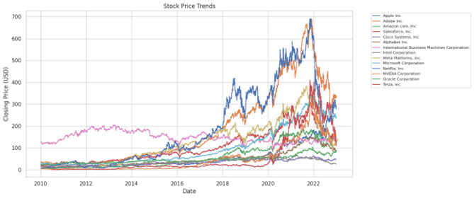

Line chart of closing prices over time for all 14 companies. NVIDIA and Amazon exhibit steep upward trajectories, while others display more modest or volatile growth, reflecting differences in business performance and investor sentiment.

---

### 2. Average Closing Price by Company
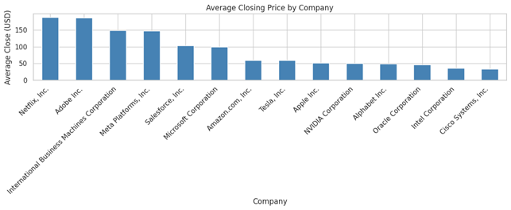

Bar chart ranking companies by average closing price across the full period. Higher averages reflect sustained investor confidence and stronger market valuation.

---

### 3. Distribution of Daily Returns
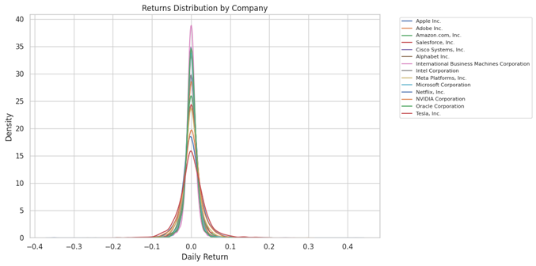

KDE (Kernel Density Estimate) plot showing the spread of daily returns per company. A narrower, taller curve = stable returns. A wider, flatter curve = higher volatility and investment risk.

---

### 4. Volume vs Closing Price
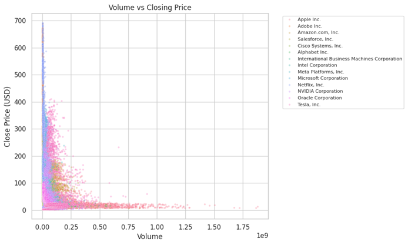

Scatter plot testing whether trading volume correlates with price. The weak relationship confirms that stock prices are driven by multiple factors — sentiment, earnings, macroeconomics — rather than volume alone.

---

### 5. Return Distribution — Volatility Comparison
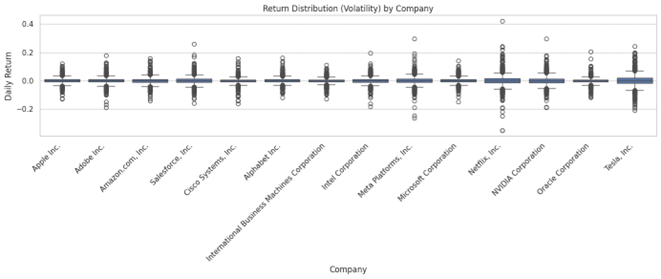

Box plot comparing daily return distributions across companies. Wider interquartile ranges and more extreme outliers indicate higher risk. Conservative investors favour companies with compact, symmetric distributions.

---

### 6. Correlation Heatmap of Daily Returns
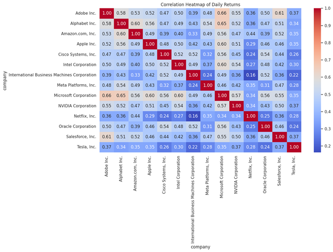

Pearson correlation matrix of daily returns across all companies. Values above 0.7 between most pairs indicate the stocks move in tandem, confirming that holding multiple tech stocks offers **limited diversification** against systemic sector risk.

---

### 7. Risk vs Return Trade-off
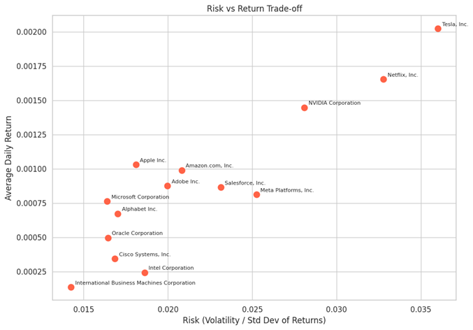

Each company is plotted at `(volatility, mean return)`. Companies in the **top-right** offer high return at high risk; **bottom-left** companies are stable choices for risk-averse investors. This chart directly confirms the fundamental finance principle of the risk-return trade-off.

---

### 8. 30-Day Moving Average (All Companies)

Three sample charts shown below — the notebook generates one chart per company (14 total).

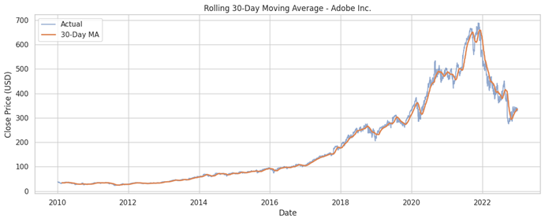
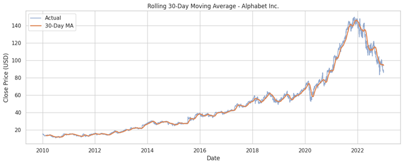
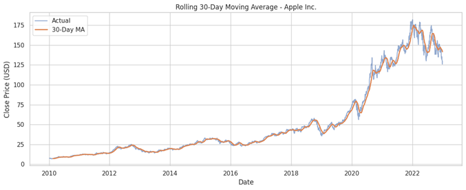

The MA_30 smooths short-term price noise to reveal the underlying long-term trend for each company. Sustained tracking above the MA_30 signals an uptrend; dips below signal weakness. Comparing across companies shows clear differences in trend stability and crossover frequency.

---

### 9. Cumulative Returns Over Time
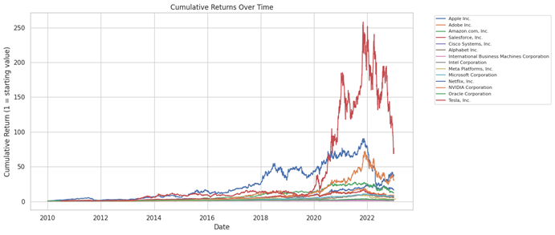

Tracks how a ₹1 investment would have compounded from the first trading date. Steep curves represent the greatest long-term value creation. This chart identifies the best long-term performer across the entire observation period.

---

### 10. Linear Regression Prediction (All Companies)

Three sample predictions shown below — the notebook runs and evaluates a model for all 14 companies.

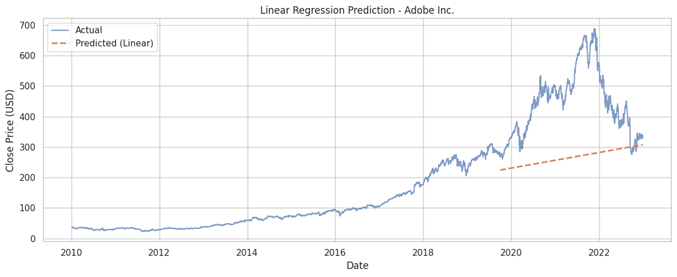
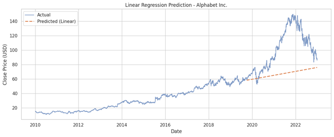
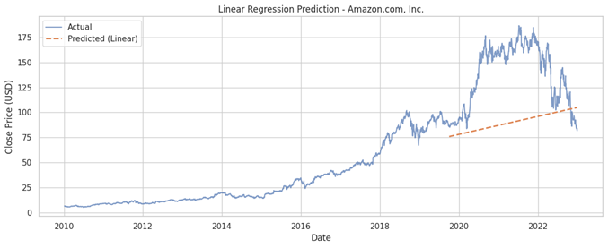

A linear regression model was fitted per company using date ordinal as the sole predictor. The model captures general price direction but fails to represent short-term volatility or non-linear behaviour. Performance was evaluated using **MSE** and **R²**. The consistently low R² scores confirm that stock prices cannot be reliably modelled with simple linear approaches.

---

## 💡 Key Insights

- **Risk-return trade-off is confirmed** — companies with the highest average daily returns (e.g., NVIDIA, Tesla) also show the greatest volatility.
- **High sector correlation** — most company pairs have correlations above 0.6–0.7, meaning the tech sector largely moves as a unit. Holding multiple tech stocks does not meaningfully reduce risk.
- **Stable vs growth stocks** — lower-volatility companies offer predictable, conservative returns; higher-volatility ones suit risk-tolerant, long-term investors.
- **Cumulative returns diverge dramatically** — small daily differences compound into large wealth gaps over a decade.
- **MA_30 is a practical trend filter** — it reliably separates signal from noise when comparing company trajectories.
- **Linear regression is a baseline, not a solution** — it captures trend direction but not volatility, seasonality, or market shocks.

---

## 🛠️ Tools & Libraries

| Tool | Purpose |
|------|---------|
| Python 3 | Core programming language |
| Pandas | Data loading, merging, grouping, feature engineering |
| NumPy | Numerical operations |
| Matplotlib | Line charts, bar charts, scatter plots, moving average |
| Seaborn | KDE plots, box plots, heatmaps |
| Scikit-learn | Linear regression, MSE and R² evaluation |
| Jupyter Notebook | Interactive development and inline visualisation |

---

## 🚀 Getting Started

### Prerequisites
```bash
pip install pandas numpy matplotlib seaborn scikit-learn jupyter
```

### Run the Notebook
```bash
git clone https://github.com/your-username/big-tech-stock-analysis.git
cd big-tech-stock-analysis
jupyter notebook big_tech_analysis.ipynb
```

Make sure `big_tech_companies.csv` and `big_tech_stock_prices.csv` are in the same directory as the notebook before running.

---

## ⚠️ Limitations

- Macroeconomic variables (interest rates, inflation, GDP) are not included.
- The analysis is retrospective — it does not reliably predict future prices.
- External events (news, earnings surprises, policy changes) are not captured.
- Linear regression does not model non-linear stock behaviour — ARIMA, Prophet, or LSTM would be more appropriate for forecasting.
- Only 14 companies are analysed; no broader market index is used as a benchmark.

---

## 🔭 Future Scope

- Incorporate ARIMA or LSTM models for time-series forecasting
- Add macroeconomic features (CPI, Fed rate, VIX) as external regressors
- Benchmark performance against the S&P 500 index
- Perform sector-level portfolio optimisation using Markowitz's Modern Portfolio Theory
- Add sentiment analysis from financial news to enrich the feature set

---

## 👤 Author

**Aditya Panda**  
Registration No: 251090052654  
Section / Roll: CD-82  
Course: Data Analytics and Visualisation (DAV)
